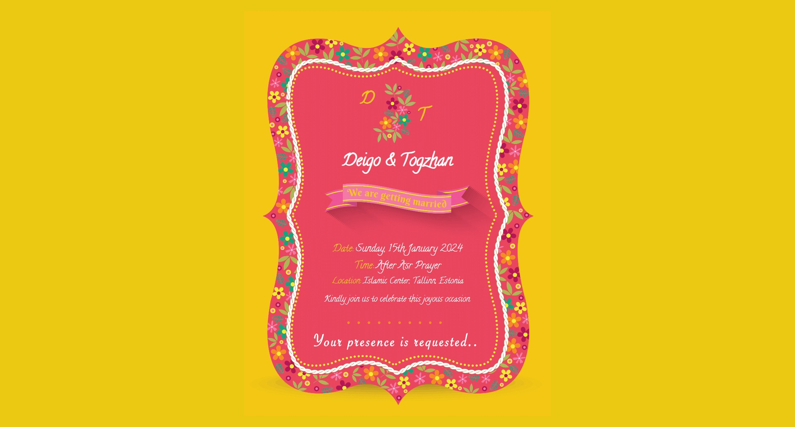

# Nikkah Ceremony Invitation

Welcome to the Nikkah Ceremony Invitation project! This project is a simple web-based invitation for a Nikkah ceremony, designed to be beautiful and animated.

## Features

- Stylish and animated invitation card.
- Event details, including date, time, and location.
- Personalized images for the bride and groom.
- RSVP information.

## Demo

[View the live demo](https://shayan6.github.io/nikkah-invitation/) - Insert the link to your live demo here.

### Screenshots

## Getting Started

Follow these instructions to get a copy of the project up and running on your local machine for development and testing purposes.

### Installation

1. Clone the repository: `git clone https://github.com/shayan6/nikkah-invitation.git`
2. Open `index.html` in your web browser.

## Usage

Customize the invitation by editing the HTML, CSS, and JavaScript files to include your event details and images.

## Built With

- HTML5
- CSS3
- JavaScript
- [Anime.js](https://animejs.com/) - For animations
- [Animate.css](https://animate.style/) - For additional animations

## Contributing

If you'd like to contribute, please fork the repository and create a pull request. You can also open an issue for discussion.

## License

This project is licensed under the MIT License - see the [LICENSE.md](LICENSE.md) file for details.
